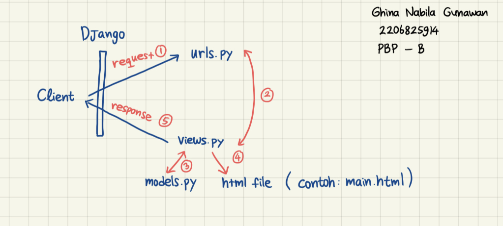

===== Aplikasi Adaptable =====

Aplikasi Adaptable yang sudah di-deploy dapat diakses melalui tautan berikut: https://ghina27-app.adaptable.app

===== Implementasi Step-by-Step =====

✅ Membuat sebuah proyek Django baru.
    - Buat direktori baru dengan nama restaurant_list.
    - Di dalam direktori tersebut, buka command prompt (Windows).
    - Buat virtual environment dengan menjalankan perintah 'python -m venv env' .
    - Di dalam direktori yang sama, buat berkas requirements.txt dan tambahkan beberapa dependencies.
    - Pastikan sudah menjalankan virtual environment terlebih dahulu, kemudian pasang dependencies dengan perintah 'pip install -r requirements.txt' .
    - Membuat proyek Django bernama 'restaurant_list' dengan perintah 'django-admin startproject shopping_list .' .

✅ Membuat aplikasi dengan nama main pada proyek tersebut.
    Aplikasi Django dibuat dengan menjalankan perintah 'python manage.py startapp main' .

✅ Melakukan routing pada proyek agar dapat menjalankan aplikasi main.
    Untuk memastikan bahwa proyek dapat menjalankan aplikasi "main", tambahkan "main" ke dalam INSTALLED_APPS di dalam file settings.py proyek.

✅ Membuat model pada aplikasi main dengan nama Item
    Buka file models.py di dalam aplikasi "main" dan buat model "Item" dengan atribut yang sesuai sebagai berikut:
        - name sebagai nama item dengan tipe CharField.
        - amount sebagai jumlah item dengan tipe IntegerField.
        - description sebagai deskripsi item dengan tipe TextField.

✅ Membuat sebuah fungsi pada views.py untuk dikembalikan ke dalam sebuah template HTML yang menampilkan nama aplikasi serta nama dan kelas kamu.
    Tambahkan baris impor dan fungsi 'show_main' dalam file views.py yang terletak di dalam berkas aplikasi 'main'.

✅ Membuat sebuah routing pada urls.py aplikasi main untuk memetakan fungsi yang telah dibuat pada views.py.
    [Routing URL Aplikasi main]
    - Buatlah berkas urls.py di dalam direktori 'main'.
    - Isi urls.py dengan baris impor dan variable app_name serta urlpatterns.
    [Routing URL Proyek]
    - Buka berkas urls.py di dalam direktori proyek 'restaurant_list', bukan yang ada di dalam direktori aplikasi 'main'.
    - Impor fungsi include dari django.urls.
    - Tambahkan rute URL seperti berikut untuk mengarahkan ke tampilan main di dalam variabel urlpatterns.

✅ Melakukan deployment ke Adaptable terhadap aplikasi yang sudah dibuat sehingga nantinya dapat diakses oleh teman-temanmu melalui Internet.

===== Bagan Request Client dan Respon =====

- Client (Browser) mengirim permintaan HTTP ke URL tertentu.
- Pada sisi server, permintaan ini diterima oleh Django URL Router di dalam 'urls.py'.
- Router akan mencari URL yang cocok dan mengarahkannya ke View Function yang sesuai di dalam 'views.py'.
- View Function akan mengakses data dari Model yang didefinisikan di dalam 'models.py'.
- View akan merender tampilan menggunakan Template HTML, menggabungkan data dari Model.
- Respon HTML dikirimkan kembali ke Client (Browser) untuk ditampilkan.

===== Penggunaan Virtual Environment =====

Singkatnya, virtual environment (lingkungan virtual) berfungsi untuk memisahkan pengaturan dan package yang diinstal pada setiap proyek Django sehingga perubahan yang dilakukan pada satu proyek tidak mempengaruhi proyek lainnya. Dengan kata lain, setiap proyek Django sebaiknya memiliki virtualenv-nya sendiri agar proyek kita lebih terstruktur dan mudah dikelola.
Namun, mari kita bahas lebih lanjut mengenai alasan-alasan utama penggunaannya:
    - Isolasi Dependensi: Anda dapat memiliki versi Python dan dependensi yang berbeda untuk setiap proyek tanpa konflik.
    - Pengelolaan Dependensi: Virtual Environment memungkinkan Anda menginstal dan mengelola dependensi proyek secara terpisah, meminimalkan potensi masalah dengan dependensi bersamaan.
    - Memudahkan Pemeliharaan: Dengan menggunakan Virtual Environment, Anda dapat dengan mudah menyimpan konfigurasi dependensi proyek, membuatnya portabel, dan berbagi dengan tim pengembangan.

===== MVC, MVT, dan MVVM =====

Perbedaan ketiganya: MVC adalah pendekatan yang lebih tua dan terpisah, MVT adalah pendekatan yang digunakan dalam Django, dan MVVM adalah pendekatan yang populer dalam pengembangan aplikasi web berbasis JavaScript.

Perbedaan utama adalah bagaimana komponen-komponen ini berinteraksi satu sama lain dalam arsitektur aplikasi. 

✅ MVC (Model-View-Controller):
    - Model: Mewakili data dan logika bisnis aplikasi.
    - View: Bertanggung jawab untuk menampilkan data kepada pengguna.
    - Controller: Mengatur aliran kontrol dalam aplikasi dan menghubungkan Model dan View. Menerima input dari pengguna dan mengarahkannya ke Model atau View yang sesuai.
    - Terutama digunakan dalam kerangka kerja seperti Ruby on Rails.

✅ MVT (Model-View-Template):
    - Model: Mirip dengan Model dalam MVC, mewakili data dan logika bisnis.
    - View: Menampilkan data dan mengatur tampilan, tetapi memiliki fungsi lebih dari Controller dalam MVC. Dalam Django, View juga dapat berfungsi sebagai Controller.
    - Template: Bertanggung jawab untuk tampilan HTML dan bagaimana data ditempatkan dalam tampilan.
    - Ini adalah pendekatan yang digunakan oleh Django.

✅ MVVM (Model-View-ViewModel):
    - Model: Sama seperti dalam MVC dan MVT, mewakili data dan logika bisnis.
    - View: Mirip dengan View dalam MVC dan MVT, bertanggung jawab untuk menampilkan data.
    - ViewModel: Bertanggung jawab untuk mengelola tampilan dan logika tampilan. Memfasilitasi pengikatan data antara Model dan View.
    - Terutama digunakan dalam pengembangan aplikasi berbasis web dengan kerangka kerja JavaScript seperti Angular atau Vue.js.

