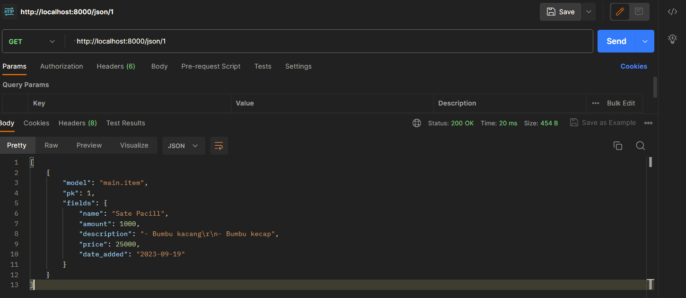

Nama: Ghina Nabila Gunawan\
NPM: 2206825914\
Kelas: PBP-B\

<h1>TUGAS 5</h1>

**===== Manfaat dari Setiap Element Selector =====**

- **Tag Selector (`tagname`)**: Memilih semua elemen dengan tag tertentu, misalnya `p` untuk memilih semua paragraf. Berguna saat kita ingin mengatur gaya teks untuk jenis elemen tertentu di seluruh halaman.
- **ID Selector (`#id`)**: Memilih elemen dengan atribut `id` tertentu. Berguna saat kita ingin mengatur gaya untuk elemen khusus yang memiliki `id` tertentu.
- **Class Selector (`.classname`)**: Memilih semua elemen dengan atribut `class` tertentu. Berguna saat kita ingin mengatur gaya untuk kelompok elemen yang memiliki class tertentu.
- **Attribute Selector (`[attribute]`)**: Memilih elemen berdasarkan atribut khususnya, misalnya `[data-toggle="modal"]` akan memilih elemen dengan atribut `data-toggle` yang bernilai "modal". Berguna saat kita ingin memilih elemen berdasarkan atribut khusus.
- **Universal Selector (`*`)**: Memilih semua elemen dalam halaman. Dapat digunakan untuk mengatur gaya dasar untuk semua elemen.

**===== HTML5 Tags =====**   
- `<header>`: Mendefinisikan bagian atas dokumen atau bagian dari sebuah halaman web.
- `<nav>`: Menunjukkan navigation area.
- `<section>`: Menandai bagian-bagian (section) dalam konten halaman.
- `<article>`: Mendefinisikan sebuah artikel dalam halaman.
- `<aside>`: Mendefinisikan konten yang berdiri sendiri, seperti iklan atau sidebar.
- `<footer>`: Mendefinisikan bagian bawah dokumen atau bagian dari sebuah halaman web.
- `<video>`: Memasukkan video ke dalam halaman.
- `<audio>`: Memasukkan audio ke dalam halaman.
   
**===== Perbedaan antara Margin dan Padding =====**

1. **Margin:** space (ruang) di luar elemen. Ini mengatur jarak antara elemen dengan elemen lain di sekitarnya. Margin tidak memiliki latar belakang dan tidak memengaruhi latar belakang elemen lain.
2. **Padding:** space (ruang) di dalam elemen, antara konten elemen dan batasnya. Padding memengaruhi latar belakang elemen dan memberikan elemen tersebut space (ruang) di sekitarnya.

**===== Perbedaan antara Bootstrap dan Tailwind CSS =====**

**Bootstrap:**
- Bootstrap adalah kerangka kerja CSS yang dirancang dengan komponen siap pakai.
- Memiliki default style yang dapat digunakan dengan cepat.
- Sangat cocok untuk pengembangan cepat dan prototyping.
- Lebih cocok untuk proyek yang lebih besar dengan banyak komponen dan kebutuhan desain yang kompleks.
- Memerlukan lebih sedikit penyesuaian kustom.

**Tailwind CSS**
- Tailwind CSS adalah kerangka kerja CSS yang berfokus pada penggunaan utility class untuk membangun desain.
- Memungkinkan kontrol yang lebih besar terhadap desain dengan menggabungkan kelas-kelas utility.
- Cocok untuk proyek dengan desain yang unik dan beragam.
- Memungkinkan tingkat penyesuaian yang tinggi, tetapi memerlukan penulisan lebih banyak kode.

**Kapan Menggunakan Bootstrap atau Tailwind?**
   
- Gunakan **Bootstrap** jika kita ingin prototyping cepat, atau jika kita bekerja dalam tim besar yang memerlukan konsistensi dan menggunakan kerangka kerja yang sudah ada.
- Gunakan **Tailwind CSS** jika kita ingin desain yang sangat kustom, atau jika kita lebih suka memiliki kendali tinggi atas desain yang dibuat.

Tetapi saya pribadi lebih prefer menggabungkan keduanya, menurut saya gabungan antara penggunaan CSS kustom dan Bootstrap lebih baik karena kita dapat menyesuaikan desain dan komponen Bootstrap sesuai dengan kebutuhan proyek kita.

- **Customization**: Kita dapat menyesuaikan tampilan situs agar terlihat lebih baik. Ini memungkinkan kita untuk memperbaiki atau mengubah gaya komponen Bootstrap sesuai dengan desain yang diinginkan.

- **Overriding Styles**: Kita bisa menggunakan CSS kustom untuk menimpa default style dari Bootstrap yang mungkin tidak sesuai dengan kebutuhan proyek kita (misalnya perubahan warna, jenis huruf, jarak, atau perubahan lain dalam tampilan).

- **Responsiveness**: Bootstrap memiliki komponen responsif yang kuat. Dengan menggunakan CSS kustom, kita dapat menyesuaikan tata letak atau tampilan komponen Bootstrap untuk situasi khusus pada berbagai device atau ukuran layar.

**===== Implementasi Step-by-Step =====**

✅ Kustomisasi desain pada templat HTML yang telah dibuat pada Tugas 4 dengan menggunakan CSS atau CSS framework (seperti Bootstrap, Tailwind, Bulma) dengan ketentuan sebagai berikut:

1. Kustomisasi halaman login, register, dan tambah inventori semenarik mungkin.
2. Kustomisasi halaman daftar inventori menjadi lebih berwarna maupun menggunakan approach lain seperti menggunakan `Card`.

- Jika belum, di dalam `templates/base.html`, tambahkan tag `<meta name="viewport">` agar halaman web dapat menyesuaikan ukuran dan perilaku perangkat mobile (apabila belum).
- Tambahkan Bootstrap CSS dan juga JS.
- Karena saya ingin menggunakan dropdowns, popover, tooltips yang disediakan framework Bootstrap, maka perlu menambahkan 2 baris script JS

**[Kustom halaman tambah inventori]**
- Dalam `views.py` yang ada pada subdirektori `main`, dan buatlah fungsi baru bernama `edit_item` yang menerima parameter `request` dan `id`.
- Membuat berkas HTML baru dengan nama `edit_item.html` pada subdirektori `main/templates`.
- Buka `urls.py` pada direktori `main` dan import fuction `edit_item` yang sudah dibuat tadi, tambahkan juga path url ke dalam `urlpatterns`.
- Buka `main.html` yang berada pada subdirektori `main/templates`. Tambahkan potongan kode untuk menampilkan tombol edit yang sejajar dengan elemen `<td>` terakhir.
- Saya juga menambahkan navigation bar pada bagian atas halaman tambah inventori, yaitu dengan cara menambahkan beberapa baris kode `<nav class>` sebelum bagian kode `
`
- Serta ada tambahan footer di bagian bawah page nya, saya mengedit beberapa baris kode pada `main.html` dan `base.html`.

**[Kustom halaman `Add New Item` dan `Edit Item` dengan `Add Image`]**
- Buka berkas `models.py` pada direktori `main`, tambahkan impor `FileExtensionValidator` untuk memvalidasi jenis image yang dapat kita masukkan seperti `jpg, jpeg, png`. Lalu tambahkan field baru pada class models `Item` yaitu `ImageField`.
- Buka command prompt dan nyalakan `virtual-env`, lakukan `python manage.py makemigrations` dan `python manage.py migrate`
- Pada berkas `templates/create_item.html` dan `templates/edit_item.html` saya menambahkan beberapa baris kode `Card`.
- Kemudian saya menambahkan baris kode `<form method="POST" enctype="multipart/form-data">` agar kita dapat memasukkan file image (gambar) dengan format yang sudah disesuaikan pada `views.py` yaitu dengan menambahkan baris kode `request.FILES` untuk menangani file gambar pada function `create_item` dan `edit_item`.
- Buka berkas `urls.py` pada direktori `main` lalu tambahkan beberapa impor yaitu `static` dan `settings` agar kita dapat menerapkan kode `static` pada `settings.MEDIA_URL` dalam variabel `urlpatterns`
- Oleh karena itu, jangan lupa pada `settings.py` dalam direktori `restaurant_list` kita perlu menambahkan variabel `MEDIA_URL` dan `MEDIA_ROOT` di bagian bawah baris kode `STATIC_ROOT`.

**[Kustom halaman login dan register]**
- Pada kustom halaman login dan register, saya menggunakan implementasi `Card` dan melakukan styling pada bagian `body`, `.card` , `.card-title` , dan `.btn-primary`

✅ **{BONUS}** Memberikan warna yang berbeda (teks atau background) pada baris terakhir dari item pada inventori menggunakan CSS.
- Buka `templates/main.html` pada direktori `main`.
- Saya menambahkan CSS dalam tag `<style>` (di bagian atas `<head>`).
- Kemudian saya menambahkan variabel yang menghitung baris yang sedang di-render, kemudian menambahkan kelas CSS ke elemen HTML yang sesuai dengan baris terakhir.
- Saya menggunakan `forloop.last` yang disediakan oleh Django untuk mengidentifikasi baris terakhir dalam perulangan. Jika kondisi ini terpenuhi, baru kita tambahkan kelas CSS "last-row" ke elemen `<tr>` untuk baris terakhir.

<h1>TUGAS 4</h1>

**===== Apa itu Django UserCreationForm, dan jelaskan apa kelebihan dan kekurangannya? =====**

Django `UserCreationForm` adalah salah satu form bawaan yang disediakan oleh Django untuk memudahkan pembuatan form pendaftaran atau registrasi user dalam aplikasi web. Form ini dirancang khusus untuk membuat akun baru user dengan informasi seperti username dan password. \
Kelebihan dari Django `UserCreationForm` adalah sebagai berikut:
- Formulir ini sangat mudah diimplementasikan dalam aplikasi Django karena sudah disediakan secara default.
- `UserCreationForm` mencakup validasi bawaan (otomatis) untuk memastikan bahwa data yang dimasukkan user sesuai dengan persyaratan yang ditentukan, seperti kompleksitas password.
- Formulir ini terintegrasi langsung dengan authentication system pada Django, sehingga memudahkan autentikasi user yang mendaftar.
    
Namun, ada beberapa kekurangan yang perlu diperhatikan:
- Jika kita perlu menambahkan lebih banyak bidang informasi pada proses pendaftaran, kita perlu customize atau membuat formulir pendaftaran sendiri.
- `UserCreationForm` bersifat sederhana dan tidak termasuk fitur lanjutan seperti verifikasi email, konfirmasi password, atau pilihan masuk dengan pihak ketiga (seperti OAuth).

**===== Apa perbedaan antara autentikasi dan otorisasi dalam konteks Django, dan mengapa keduanya penting? =====**

- **Autentikasi (Authentication)** adalah proses untuk mengidentifikasi user dan memastikan bahwa user tersebut adalah orang yang di claim. Dalam Django, ini berarti memeriksa apakah user telah berhasil memasukkan informasi yang benar (seperti username dan password) untuk mengakses akun mereka.

- **Otorisasi (Authorization)** adalah proses yang terjadi setelah autentikasi dan menentukan apa yang diizinkan atau tidak diizinkan user untuk lakukan setelah mereka berhasil login. Dalam Django, ini mengacu pada pengaturan role dan izin user, serta mengontrol akses user terhadap bagian-bagian tertentu dari aplikasi.

Keduanya penting karena autentikasi memastikan bahwa user yang masuk adalah user yang valid, sedangkan otorisasi memastikan bahwa user tersebut hanya memiliki akses ke bagian aplikasi yang sesuai dengan role dan izinnya. 

**===== Apa itu cookies dalam konteks aplikasi web, dan bagaimana Django menggunakan cookies untuk mengelola data sesi pengguna? =====**

Cookies adalah file teks kecil yang disimpan pada komputer user saat mereka mengunjungi situs web. Cookies digunakan oleh situs web untuk menyimpan informasi khusus pada user device dan dapat digunakan untuk mengenali user, mengingat preferensi mereka, dan mengelola session user. Dalam konteks Django, cookies digunakan untuk mengelola data user session.

Django menggunakan cookies untuk menyimpan ID user session. Ketika user mengakses situs web, Django akan membuat ID session unik untuk user tersebut. ID session ini disimpan dalam cookie di user device. Setiap kali user melakukan permintaan ke server, ID session tersebut digunakan untuk mengidentifikasi user session dan mengakses data session seperti data login atau preferensi user.

**===== Apakah penggunaan cookies aman secara default dalam pengembangan web, atau apakah ada risiko potensial yang harus diwaspadai? =====**

Penggunaan cookies dalam pengembangan web aman dan memiliki keuntungan sebagai berikut:
- Cookies memungkinkan server untuk mengelola user manajemen session, yang merupakan fitur penting dalam aplikasi web yang memerlukan autentikasi dan otorisasi.
- Cookies dapat digunakan untuk mengingat preferensi user, seperti bahasa yang dipilih atau tema yang dipersonalisasi.

Namun, penggunaan cookies juga memiliki potensi risiko yang perlu diwaspadai:
- Penggunaan cookies yang tidak tepat atau melibatkan pelacakan yang invasif dapat mengancam privasi user, sehingga informasi pribadi mereka dapat digunakan tanpa izin.
- Cookies yang tidak diimplementasikan dengan benar dapat menjadi sasaran serangan seperti Cross-Site Scripting (XSS) atau Cross-Site Request Forgery (CSRF). Ini dapat membahayakan keamanan aplikasi web.
- Cookies bergantung pada device client (browser pengguna) untuk menyimpan data. Ini berarti user dapat memutuskan untuk menonaktifkan cookies atau menghapusnya, yang dapat mempengaruhi pengalaman user dalam aplikasi web.

Untuk menghindari risiko ini, pengembang web harus menggunakan cookies dengan hati-hati dan mematuhi praktik terbaik keamanan. Selain itu, peraturan privasi yang berlaku (seperti GDPR di Eropa) mengatur penggunaan cookies dan perlindungan privasi user.

**===== Implementasi Step-by-Step =====**\
✅ Mengimplementasikan fungsi registrasi, login, dan logout

**[REGISTRASI]**
- Buka `views.py` yang ada pada subdirektori `main` dan buatlah fungsi dengan nama `register` yang menerima parameter `request`.
- Tambahkan import `redirect`, `UserCreationForm`, dan `messages` pada bagian paling atas.
- Membuat berkas HTML baru dengan nama `register.html` pada folder `main/templates`.
- Buka `urls.py` yang ada pada subdirektori `main` dan impor `from main.views import register` .
- Tambahkan ` path('register/', register, 'name=register'), ` ke dalam `urlpatterns` untuk mengakses fungsi yang sudah diimpor tadi.
  
**[LOGIN]**
- Buka `views.py` yang ada pada subdirektori `main` dan buatlah fungsi dengan nama `login_user` yang menerima parameter `request`.
- Tambahkan import `authenticate`, `login`, dan `login_required` pada bagian paling atas.
- Tambahkan kode `@login_required(login_url=`/login`)` di atas fungsi `show_main` agar halaman main hanya dapat diakses oleh user yang sudah login (terautentikasi).
- Membuat berkas HTML baru dengan nama `login.html` pada folder `main/templates`.
- Buka `urls.py` yang ada pada subdirektori `main` dan impor `from main.views import login_user` .
- Tambahkan ` path('login/', login_user, name='login'), ` ke dalam `urlpatterns` untuk mengakses fungsi yang sudah diimpor tadi.
  
**[LOGOUT]**
- Buka `views.py` yang ada pada subdirektori `main` dan buatlah fungsi dengan nama `logout_user` yang menerima parameter `request`.
- Tambahkan import `logout` pada bagian paling atas.
- Tambahkan beberapa potongan kode setelah hyperlink tag untuk Add New Item pada berkas `main.html`.
- Buka `urls.py` yang ada pada subdirektori `main` dan impor `from main.views import logout_user` .
- Tambahkan ` path('logout/', logout_user, name='logout'), ` ke dalam `urlpatterns` untuk mengakses fungsi yang sudah diimpor tadi.
        
✅ Membuat dua akun user dengan masing-masing tiga dummy data menggunakan model yang telah dibuat pada aplikasi sebelumnya untuk setiap akun di lokal.

**{Akun 1 - ghina27}**\
 

**{Akun 2 - ghina2703}**\
 

✅ Menghubungkan model `Item` dengan `User`.
- Buka `models.py` yang ada pada subdirektori `main` dan tambahkan impor `from django.contrib.auth.models import User`.
- Pada model `Item` yang sudah dibuat, tambahkan potongan kode     `user = models.ForeignKey(User, on_delete=models.CASCADE)`.
- Buka `views.py` yang ada pada subdirektori `main`, dan ubah beberapa potongan kode pada fungsi `create_item`.
- Mengubah beberapa kode pada fungsi `show_main`, salah satunya dengan menambahkan kode `request.user.username` yang berfungsi untuk menampilkan username pengguna yang login pada halaman main.
- Simpan semua perubahan, dan lakukan migrasi model dengan `python manage.py makemigrations`.
- Lakukan `python manage.py migrate` untuk mengaplikasikan migrasi yang dilakukan pada poin sebelumnya.
        
✅ Menampilkan detail informasi user yang sedang logged in seperti username dan menerapkan `cookies` seperti `last login` pada halaman utama aplikasi.
- Lakukan logout terlebih dahulu jika sedang menjalankan aplikasi Django.
- Buka `views.py` yang ada pada subdirektori `main` dan tambahkan import `HttpResponseRedirect`, `reverse`, dan `datetime` pada bagian paling atas.
- Pada fungsi `login_user`, kita akan menambahkan fungsi untuk menambahkan cookie yang bernama `last_login` untuk melihat kapan terakhir kali pengguna melakukan login. Caranya adalah dengan mengganti beberap baris kode yang ada pada blok `if user is not None`.
- Pada fungsi show_main, tambahkan potongan kode ` `last_login`: request.COOKIES[`last_login`] ` ke dalam variabel context.
- Ubah fungsi `logout_user` dengan menambahkan kode ` response.delete_cookie(`last_login`) ` yang berfungsi untuk menghapus cookie `last_login` saat pengguna melakukan `logout`.
- Buka berkas `main.html` dan tambahkan potongan kode `Sesi terakhir login: {{ last_login }}` di antara tabel dan tombol logout untuk menampilkan data last login.
- Untuk melihat data cookie `last_login`, kita dapat mengakses fitur `inspect element` dan membuka bagian `Application/Storage`. Klik bagian `Cookies` dan kita dapat melihat data cookies yang tersedia. Selain `last_login`, kita juga dapat melihat data `sessionid` dan `csrftoken`.

✅ **{BONUS}** Tambahkan tombol dan fungsi untuk menambahkan amount suatu objek sebanyak satu dan tombol untuk mengurangi jumlah stok suatu objek sebanyak satu. Selain itu, tambahkan tombol dan fungsi untuk menghapus suatu objek dari inventori.
- Buka `models.py` yang ada pada subdirektori `main` dan ubahlah variabel `amount` dengan menambahkan field yang akan menyimpan jumlah stok dari setiap objek.
- Buka `views.py` yang ada pada subdirektori `main` dan tambahkan fungsi `add_item`, `reduce_item`, dan `delete_item`.
- Buka `urls.py` yang ada pada subdirektori `main` dan tambahkan impor `from main.views import add_item, reduce_item, delete_item`.
- Pada variabel `urlpatterns` tambahkan path untuk `add_item`, `reduce_item`, dan `delete_item` dengan berdasarkan `pk=id`.
- Bukalah berkas `main.html` pada folder `main/templates`. Tambahkan beberapa baris kode untuk menampilkan dan mengimplementasikan tombol `+`, `-`, `Delete`.

<h1>TUGAS 3</h1>

**===== Perbedaan Form POST dan Form GET dalam Django =====**\
**1. Form POST:**
- Ketika data dikirim menggunakan metode POST, data akan dikirimkan dalam HTTP request body, sehingga data tidak terlihat di URL.
- Data yang dikirim melalui POST cocok untuk data sensitif atau data yang besar.
- Biasanya digunakan saat kita ingin mengirim data yang akan menyebabkan perubahan pada server, seperti membuat entri baru di basis data.

**2. Form GET:**
- Ketika data dikirim menggunakan metode GET, data akan ditambahkan ke URL sebagai parameter query string.
- Data yang dikirim melalui GET seharusnya tidak sensitif dan sebaiknya tidak mengandung data yang sangat besar.
- Biasanya digunakan saat kita ingin melakukan pencarian atau mengakses server-side resource tanpa mempengaruhi status server.

**===== Perbedaan antara XML, JSON, dan HTML dalam konteks pengiriman data =====**\
**1. XML (eXtensible Markup Language):**
- XML adalah markup language yang digunakan untuk mendefinisikan struktur data yang dapat disesuaikan.
- XML menggunakan tag yang dapat disesuaikan oleh user untuk mendefinisikan elemen-elemen data.
- XML lebih kompleks dan berat dibandingkan JSON dan HTML.
- Digunakan dalam beberapa konteks, seperti pertukaran data antar aplikasi dan penyimpanan konfigurasi.
    
**2. JSON (JavaScript Object Notation):**
- JSON adalah lightweight data format yang digunakan untuk pertukaran data antara aplikasi modern web.
- JSON menggunakan objek JavaScript untuk mewakili data dalam format teks.
- JSON lebih mudah dibaca/diterjemahkan dalam bahasa manusia dan lebih mudah diurai oleh mesin dibandingkan XML.
- Digunakan secara luas dalam RESTful API dan komunikasi antar aplikasi.
    
**3. HTML (HyperText Markup Language):**
- HTML adalah markup language yang digunakan untuk membuat tampilan halaman web.
- HTML menggambarkan struktur dan tampilan konten pada halaman web.
- HTML digunakan oleh web browser untuk merender halaman web.
- Digunakan untuk membuat user interface pada web.

**===== Mengapa JSON sering digunakan dalam pertukaran data antara aplikasi web modern =====**
- JSON memiliki format yang ringan dan mudah dibaca oleh manusia sehingga memudahkan debugging dan pengembangan.
- JSON dapat dengan mudah diurai oleh bahasa pemrograman yang berbeda, sehingga memudahkan komunikasi antara berbagai platform dan teknologi.
- JSON menggunakan objek JavaScript, sehingga secara alami cocok dengan bahasa pemrograman JavaScript yang banyak digunakan di sisi web client.
- Dalam arsitektur RESTful API, JSON sering digunakan sebagai format pertukaran data karena kesederhanaannya dan kemampuannya untuk merepresentasikan berbagai jenis data.
- Sebagian besar bahasa pemrograman modern memiliki dukungan JSON yang kuat, membuatnya mudah diimplementasikan di berbagai platform.

**===== Implementasi Step-by-Step =====**\
✅ Membuat input form untuk menambahkan objek model pada app sebelumnya.
- Membuat berkas baru pada direktori `main` dengan nama `forms.py` untuk membuat struktur form yang dapat menerima data produk baru.
- Menambahkan impor pada berkas `views.py` yaitu `HttpResponseRedirect` , `ItemForm` , dan `reverse`.
- Membuat fungsi baru dengan nama `create_item` pada berkas tersebut yang menerima parameter `request`.
- Mengubah fungsi `show_main` pada berkas `views.py` dengan ` `items`: Item.objects.all(), ` .
- Membuat berkas HTML baru dengan nama `create_item.html` pada direktori `main/templates`.
- Membuka `main.html` dan menambahkan beberapa baris kode di dalam `` untuk menampilkan data produk dalam bentuk table serta tombol "Add New Item" yang akan redirect ke halaman form.

✅ Menambahkan 5 fungsi views untuk melihat objek yang sudah ditambahkan dalam format HTML, XML, JSON, XML by ID, dan JSON by ID.\
**[HTML]**

- Sudah dibuat pada implementasi checklist sebelumnya, yaitu dengan membuat fungsi `show_main` dan `create_item`.

**[XML]**

- Membuka `views.py` yang ada pada folder main dan tambahkan import `HttpResponse` dan `Serializer` pada bagian paling atas.
- Membuat sebuah fungsi yang menerima parameter request dengan nama `show_xml` dan buatlah sebuah variabel di dalam fungsi tersebut yang menyimpan hasil query dari seluruh data yang ada pada `Item`.
- Menambahkan return function berupa `HttpResponse` yang berisi parameter data hasil query yang sudah diserialisasi menjadi XML dan parameter ` content_type="application/xml" `.
  
**[JSON]**

- Membuka `views.py` yang ada pada folder `main` dan buatlah sebuah fungsi baru yang menerima parameter request dengan nama `show_json` dengan sebuah variabel di dalamnya yang menyimpan hasil query dari seluruh data yang ada pada `Item`.
- Menambahkan return function berupa `HttpResponse` yang berisi parameter data hasil query yang sudah diserialisasi menjadi JSON dan parameter ` content_type="application/json" `.

**[XML by ID]**

- Membuat sebuah fungsi baru yang menerima parameter request dan id dengan nama `views.py` yang ada pada folder main dan `show_xml_by_id`.
- Membuat sebuah variabel di dalam fungsi tersebut yang menyimpan hasil query dari data dengan id tertentu yang ada pada `Item`.
- Tambahkan return function berupa `HttpResponse` yang berisi parameter data hasil query yang sudah diserialisasi menjadi XML dan parameter `content_type` dengan value  ` "application/xml" `.

**[JSON by ID]**

- Membuat sebuah fungsi baru yang menerima parameter request dan id dengan nama `views.py` yang ada pada folder main dan `show_json_by_id`.
- Membuat sebuah variabel di dalam fungsi tersebut yang menyimpan hasil query dari data dengan id tertentu yang ada pada `Item`.
- Tambahkan return function berupa `HttpResponse` yang berisi parameter data hasil query yang sudah diserialisasi menjadi XML dan parameter `content_type` dengan value  ` "application/xml" `.

✅ Membuat routing URL untuk masing-masing views yang telah ditambahkan pada poin 2.\
**[HTML]**
- Import fungsi `create_item` pada `urls.py` yang ada pada folder `main`.
- Tambahkan path url ke dalam `urlpatterns` pada `urls.py` di `main` untuk mengakses fungsi yang sudah di-import pada poin sebelumnya.

**[XML]**

- Buka `urls.py` yang ada pada folder `main` dan import fungsi `show_xml`.
- Menambahkan path url ke dalam `urlpatterns` untuk mengakses fungsi yang sudah diimpor tadi.

**[JSON]**

- Buka `urls.py` yang ada pada folder `main` dan import fungsi `show_json`.
- Menambahkan path url ke dalam urlpatterns untuk mengakses fungsi yang sudah diimpor tadi.

**[XML by ID]**

- Buka `urls.py` yang ada pada folder `main` dan impor fungsi `show_xml_by_id`.
- Tambahkan path url ke dalam `urlpatterns` untuk mengakses fungsi yang sudah diimpor tadi.

**[JSON by ID]**
- Buka `urls.py` yang ada pada folder `main` dan impor fungsi `show_json_by_id`.
- Tambahkan path url ke dalam `urlpatterns` untuk mengakses fungsi yang sudah diimpor tadi.

✅ Mengakses kelima URL di poin 2 menggunakan Postman, membuat screenshot dari hasil akses URL pada Postman, dan menambahkannya ke dalam README.md.

✅ **{BONUS}** Menambahkan pesan "Kamu menyimpan X item pada aplikasi ini".
- Di dalam `views.py` saya menambahkan kode untuk menghitung jumlah item yang tersimpan di database, yaitu menggunakan `num_items = items.count()` .
- Di dalam file `main.html`, saya menambahkan pesan `Kamu menyimpan {{ num_items }} item pada aplikasi ini.`

**===== Mengakses kelima URL di poin 2 menggunakan Postman =====**\
**1. HTML**

**2. XML**

**3. JSON**

**4. XML by ID**

**5. JSON by ID**

<h1>TUGAS 2</h1>

**===== Aplikasi Adaptable =====**\
Aplikasi Adaptable yang sudah di-deploy dapat diakses melalui tautan berikut: https://ghina27-app.adaptable.app

Tema dari project saya yaitu aplikasi sederhana mengenai pengelolaan stok restoran.

**===== Implementasi Step-by-Step =====**\
✅ Membuat sebuah proyek Django baru.\
    - Buat direktori baru dengan nama restaurant_list.\
    - Di dalam direktori tersebut, buka command prompt (Windows).\
    - Buat virtual environment dengan menjalankan perintah `python -m venv env` .\
    - Di dalam direktori yang sama, buat berkas `requirements.txt` dan tambahkan beberapa dependencies.\
    - Pastikan sudah menjalankan virtual environment terlebih dahulu, kemudian pasang dependencies dengan perintah `pip install -r requirements.txt` .\
    - Membuat proyek Django bernama `restaurant_list` dengan perintah `django-admin startproject restaurant_list .` .

✅ Membuat aplikasi dengan nama main pada proyek tersebut.\
    Aplikasi Django dibuat dengan menjalankan perintah `python manage.py startapp main` .

✅ Melakukan routing pada proyek agar dapat menjalankan aplikasi main.\
    Untuk memastikan bahwa proyek dapat menjalankan aplikasi `main`, tambahkan `main` ke dalam INSTALLED_APPS di dalam file `settings.py` proyek.

✅ Membuat model pada aplikasi main dengan nama Item\
    Buka file `models.py` di dalam aplikasi `main` dan buat model `Item` dengan atribut yang sesuai sebagai berikut:\
        - name sebagai nama item dengan tipe CharField.\
        - amount sebagai jumlah item dengan tipe IntegerField.\
        - description sebagai deskripsi item dengan tipe TextField.\
        - price sebagai harga item dengan tipe IntegerField.

✅ Membuat sebuah fungsi pada `views.py` untuk dikembalikan ke dalam sebuah template HTML yang menampilkan nama aplikasi serta nama dan kelas kita.\
    Tambahkan baris impor dan fungsi `show_main` dalam file `views.py` yang terletak di dalam berkas aplikasi `main`.

✅ Membuat sebuah routing pada `urls.py` aplikasi `main` untuk memetakan fungsi yang telah dibuat pada `views.py`.\
    [Routing URL Aplikasi main]\
    - Buatlah berkas `urls.py` di dalam direktori `main`.\
    - Isi `urls.py` dengan baris impor dan variable `app_name` serta `urlpatterns` .\
    [Routing URL Proyek]\
    - Buka berkas `urls.py` di dalam direktori proyek `restaurant_list`, bukan yang ada di dalam direktori aplikasi `main`.\
    - Impor fungsi include dari `django.urls` .\
    - Tambahkan rute URL seperti berikut untuk mengarahkan langsung ke tampilan `main` di dalam variabel `urlpatterns` (tanpa harus mengetikkan `/main/` terlebih dahulu).\
        `.... path('', include('main.urls')),...`

✅ Melakukan deployment ke Adaptable terhadap aplikasi yang sudah dibuat sehingga dapat diakses melalui Internet.\
    - Setelah login, tekan tombol `New App`. Pilih `Connect an Existing Repository`.\
    - Hubungkan Adaptable.io dengan GitHub dan pilih `All Repositories` pada proses instalasi.\
    - Memilih repositori proyek `ghina27-app` sebagai basis aplikasi yang akan di-deploy. Pilih branch yang ingin dijadikan sebagai deployment branch (saya memilih main-branch).\
    - Pilih `Python App Template` sebagai template deployment.\
    - Pilih `PostgreSQL` sebagai tipe basis data yang akan digunakan.\
    - Sesuaikan versi Python dengan spesifikasi aplikasi kita (versi saya yaitu Python 3.10.11).\
    - Pada bagian Start Command masukkan perintah `python manage.py migrate && gunicorn restaurant_list.wsgi` .\
    - Masukkan nama aplikasi yang juga akan menjadi nama domain situs web aplikasi.\
    - Centang bagian `HTTP Listener on PORT` dan klik `Deploy App` untuk memulai proses deployment aplikasi.

✅ **{BONUS}** Mengimplementasikan dan mendemonstrasikan testing dasar selain testing yang diajarkan di tutorial.\
    Selain contoh dari tutorial saya telah menambahkan dua tes tambahan yaitu:\
    - `test_item_creation`: Tes ini memeriksa apakah item dapat dibuat dalam database dengan benar. Saya membuat objek `Item` baru dalam metode `setUp` dan kemudian memeriksa apakah objek tersebut ada dalam database dengan nilai yang sesuai.\
    - `test_item_list_view`: Tes ini memeriksa apakah item yang telah dibuat ditampilkan dengan benar di halaman utama (/main/). Saya menggunakan `self.assertContains` untuk memeriksa apakah teks "Test Item" ada dalam respons halaman.

**===== Bagan Request Client dan Respon =====**

- Client (Browser) mengirim permintaan HTTP ke URL tertentu.
- Pada bagian server, permintaan ini diterima oleh Django URL Router di dalam `urls.py`.
- Router akan mencari URL yang cocok dan mengarahkannya ke View Function yang sesuai di dalam `views.py`.
- View Function akan mengakses data dari Model yang didefinisikan di dalam `models.py`.
- View akan merender tampilan menggunakan Template HTML, menggabungkan data dari Model.
- Respon HTML dikirimkan kembali ke Client (Browser) untuk ditampilkan.

**===== Penggunaan Virtual Environment =====**

Singkatnya, virtual environment berfungsi untuk memisahkan pengaturan dan package yang diinstal pada setiap proyek Django sehingga perubahan yang dilakukan pada satu proyek tidak mempengaruhi proyek lainnya. Dengan kata lain, setiap proyek Django sebaiknya \memiliki virtualenv-nya sendiri agar proyek kita menjadi lebih terstruktur dan mudah dikelola.\
Alasan-alasan utama penggunaannya:\
    ✅ Isolasi Dependensi: kita dapat memiliki versi Python dan dependensi yang berbeda untuk setiap proyek tanpa konflik. Artinya, kita dapat menggunakan versi Python yang berbeda untuk setiap proyek jika diperlukan. Misalnya, proyek A memerlukan Python 3.7, sedangkan proyek B memerlukan Python 3.8. Dengan virtual environment, kita dapat mengatur dan menggunakan versi Python yang sesuai untuk setiap proyek tanpa konflik.\
    ✅ Pengelolaan Dependensi: Virtual Environment memungkinkan kita menginstal dan mengelola dependensi proyek secara terpisah, meminimalkan potensi masalah dengan dependensi bersamaan.\
    ✅ Memudahkan Pemeliharaan: Dengan menggunakan Virtual Environment, kita dapat menyimpan konfigurasi dependensi proyek dan membuatnya portabel. Kita dapat dengan menyimpan daftar dependensi proyek dalam sebuah berkas (misalnya, `requirements.txt`) sehingga dapat dengan cepat menginstal dependensi yang diperlukan di lingkungan virtual environment lainnya.

**===== MVC, MVT, dan MVVM =====**\
Perbedaan ketiganya: MVC memiliki pemisahan peran yang jelas antara komponen-komponen dalam aplikasi. Ini membuat kode lebih mudah dikelola, dipelihara, dan dioptimalkan; MVT adalah pendekatan yang digunakan dalam Django, peran `model` mewakili data dan logika bisnis aplikasi, `view` bertanggung jawab untuk menampilkan data dan mengatur tampilan, serta `template` bertanggung jawab untuk tampilan HTML dan bagaimana data ditempatkan dalam tampilan; serta MVVM adalah pendekatan yang populer dalam pengembangan aplikasi web berbasis JavaScript.

Perbedaan utama adalah bagaimana komponen-komponen ini berinteraksi satu sama lain dalam arsitektur aplikasi. 

✅ MVC (Model-View-Controller):\
    - Model: Mewakili data dan logika bisnis aplikasi.\
    - View: Bertanggung jawab untuk menampilkan data kepada user.\
    - Controller: Mengatur aliran kontrol dalam aplikasi dan menghubungkan Model dan View. Menerima input dari user \dan mengarahkannya ke Model atau View yang sesuai.\
    - Terutama digunakan dalam kerangka kerja seperti Ruby on Rails.

✅ MVT (Model-View-Template):\
    - Model: Mirip dengan Model dalam MVC, mewakili data dan logika bisnis.\
    - View: Menampilkan data dan mengatur tampilan, tetapi memiliki fungsi lebih dari Controller dalam MVC. \Dalam Django, View juga dapat berfungsi sebagai Controller.\
    - Template: Bertanggung jawab untuk tampilan HTML dan bagaimana data ditempatkan dalam tampilan.\
    - Ini adalah pendekatan yang digunakan oleh Django.

✅ MVVM (Model-View-ViewModel):\
    - Model: Sama seperti dalam MVC dan MVT, mewakili data dan logika bisnis.\
    - View: Mirip dengan View dalam MVC dan MVT, bertanggung jawab untuk menampilkan data.\
    - ViewModel: Bertanggung jawab untuk mengelola tampilan dan logika tampilan. Memfasilitasi pengikatan data antara Model dan View.\
    - Terutama digunakan dalam pengembangan aplikasi berbasis web dengan kerangka kerja JavaScript seperti Angular atau Vue.js.
